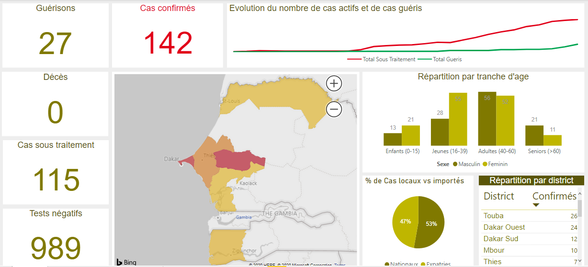

# CovidSn Dashboard

The CovidSn Dashboard was built in response to a need to rapidly provide a solution for monitoring the evolution of the Novel Corona Virus Disease in the country of Senegal.  
Here are the online links to the CovidSn Dashboard:
- [Version for Desktop Screens](http://bit.ly/dashbrd-covid19sn)
- [Version for Mobile Screens](http://bit.ly/dashbrd-covid19sn-mob)  

This repository is intended to provide the community of data enthusiasts in Senegal with datasets for experimentation purposes.  



## Disclaimer 
The information provided in this repository is for general informational purposes only. All information in this repository is provided in good faith, however we make ***no representation or warranty of any kind, expressed or implied*** regarding the accuracy, adequacy, validity, reliability, availability and completeness of any information in this repository.

## Requirements
The CovidSn dashboard is built with Microsoft Power BI Desktop. We advise that you use ```Power BI Desktop Version >= 2.79.5768.721 of March 13th 2020``` for best results.  

Microsoft Power Bi Desktop is supported for the following operating systems only: *Windows 10, Windows 7, Windows 8, Windows 8.1, Windows Server 2008 R2, Windows Server 2012, Windows Server 2012 R2*  

If you are not confortable with Microsoft Power BI, you can use your usual data analysis tools with the CSV and Excel files provided in this repository.

## File layout
Directory                   |   Description
---                         | ---
.                           | Project files such as README and LICENSE
./Covid19Sn.pbix            | Power BI report for desktop screens
./Covid19Sn-Mobile.pbix     | Power BI report for mobile screens
Press Releases CSV          | CSV Data files: Information provided in press releases and translated in csv files
Press Releases Excel        | Excel Data files: Information provided in press releases and translated in excel files
Press Releases PDF          | Official press releases published by the Ministery of Health and Social Action of the country of Senegal
Situation Reports Dataset   | Excel and CSV dataset: Information provided in Situation Reports translated in excel and csv files
Situation Reports PDF       | Official situation reports published by the Ministery of Health and Social Action of the country of Senegal
IMG                         | Pictures and screenshots

## Data
Data used to develop the CovidSn Dashboard is stored in the ```./Press Releases Excel``` folder. The folder is loaded in the two Power BI reports as a data source.

### Metrics
We calculated and used the following metrics in the dashboard:
- Number of positive tests per day
- Number of negative tests per day
- Number of deaths
- Number of active cases
- Proportion of local cases
- Proportion of imported cases
- Total to date number of positive tests
- Total to date mumber of active cases
- Total to date number of patients that recovered
- Number of positive tests per age segment and sex
- Number of positive tests per health district and administrative region

## Changes
All notable changes to this repository will be documented in the [Changelog.md](./Changelog.md) file.

## Authors
* **[Elhadji Malang](https://github.com/supermalang)**

## License

[](http://badges.mit-license.org)

This project is licensed under the MIT License - see the [LICENSE](./LICENSE) file for details